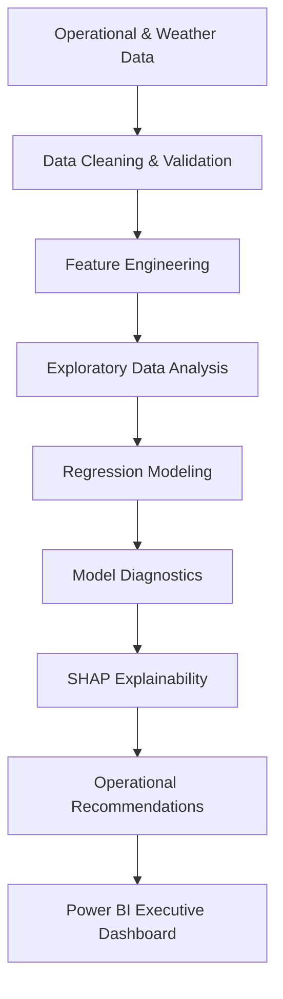
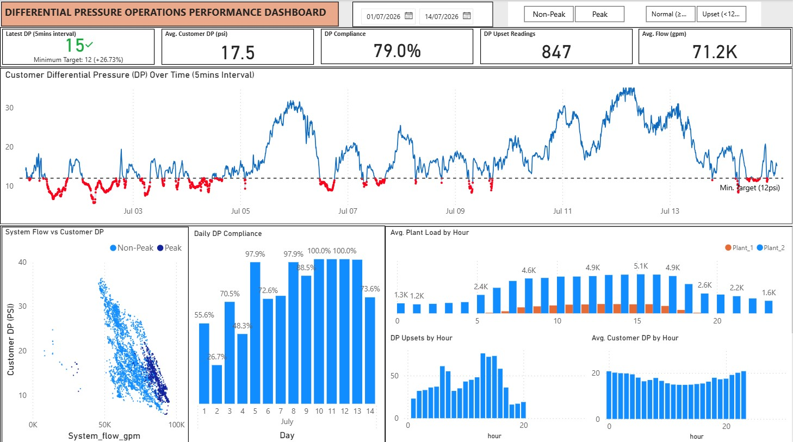

# Operational Analytics: Differential Pressure Investigation in a District Cooling Network

Operational analytics case study using Python, statistical modeling, explainable AI (SHAP), and Power BI to identify the operational drivers of customer differential pressure (DP) and support data-driven decision-making.


## Project Overview

Maintaining adequate customer differential pressure (DP) is critical to ensuring reliable chilled water delivery within a district cooling network. During periods of high cooling demand, DP can fall below operational targets, reducing system performance and increasing operational risk.

This project investigates the operational and environmental factors influencing customer DP using plant telemetry and weather data. The analysis combines statistical modelling with business intelligence to quantify key drivers, explain model behaviour, and translate findings into practical recommendations for operations teams.

---

## Business Problem

Operations teams observed recurring periods where customer differential pressure dropped below the operational target of **12 PSI**, particularly during peak demand conditions.

The objective was to answer five key business questions:

- Which operational variables have the greatest impact on customer DP?
- How do weather conditions influence system performance?
- Are there interaction or nonlinear effects between operating variables?
- What operational actions can reduce DP upsets?
- How can these insights be presented through an executive dashboard for operational monitoring?

---

## Project Highlights

- Built an end-to-end analytics workflow from raw operational telemetry to executive reporting
- Engineered operational features from time-series plant and weather data
- Developed multiple linear regression models with interaction effects
- Applied HAC robust standard errors to account for time-series autocorrelation
- Used SHAP (SHapley Additive Explanations) to improve model interpretability
- Designed an executive Power BI Operations Command Center dashboard
- Delivered actionable operational recommendations supported by statistical evidence


📸 **Project Gallery:** [View all visualizations](./result_images/)
---

## Project Workflow



---

## Tools & Technology

| Category | Tools |
|----------|------|
| Programming | Python |
| Data Analysis | Pandas, NumPy |
| Statistical Modeling | Statsmodels, Scikit-learn |
| Explainable AI | SHAP |
| Visualization | Matplotlib, Seaborn |
| Business Intelligence | Power BI |
| Development | Jupyter Notebook, Git |

---

## Repository Structure

```
├── data/
│   ├── raw/
│   └── processed/
│
├── notebooks/
│   └── code.ipynb
│
├── dashboard/
│   └── Ops_Dashboard.pbix
│
├── presentation_slide/
│   └── Operational-Investigation-of-Customer-DP.pptx
│
├── result_images/
│
├── requirements.txt
└── README.md
```

---

## Analytical Approach

The project followed a structured analytics workflow:

- Data cleaning and quality validation
- Time-series feature engineering
- Exploratory data analysis
- Correlation analysis:
A correlation matrix was generated to understand the relationships between operational variables and customer differential pressure before statistical modelling.


- Multiple linear regression:
Multiple linear regression quantified the independent contribution of each operational variable while controlling for confounding effects.


- Interaction effect modeling
- Regression diagnostics
- SHAP explainability:
SHAP values were used to validate feature importance and improve model interpretability.


- Executive dashboard development

---

## Key Findings

### 1. Output Pressure is the strongest controllable operational driver.

Increasing output pressure consistently improved customer differential pressure while maintaining other operating conditions.

---

### 2. Weather significantly influences network performance.

Higher Humidex increased cooling demand and was associated with lower customer DP during peak operating periods.

---

### 3. Peak demand creates elevated operational risk.

Most DP upsets occurred during afternoon peak hours, indicating opportunities for proactive operational intervention.


---

### 4. Operational variables interact with one another.

Plant loading demonstrated a sign reversal after controlling for system demand and flow, highlighting the importance of accounting for confounding variables rather than relying solely on pairwise correlations.

---

### 5. Interaction effects improved model performance.

Including interaction terms better represented the operational dynamics of the district cooling system and improved model explanatory power.

---

## Executive Dashboard

The accompanying Power BI dashboard provides operational visibility through:

- Customer DP monitoring
- DP trend against the 12 PSI threshold
- Flow vs DP relationship
- Humidex vs DP relationship
- Peak vs Non-Peak performance
- Plant loading comparison
- DP status distribution
- Executive operational KPIs



---

## Business Recommendations

Based on the analytical findings, the following operational improvements were proposed:

- Increase output pressure proactively before afternoon demand peaks
- Monitor weather-driven demand during periods of high Humidex
- Optimize plant dispatch during high-load conditions
- Deploy real-time alerts for declining customer DP
- Support shift handovers using live operational dashboards

---

## Business Value

## Business Value
This project demonstrates how statistical modeling and business intelligence can be applied to improve operational decision-making in utility operations.
The analytical framework can help organizations:
- Improve service reliability
- Reduce customer DP upsets
- Support proactive operational planning
- Increase visibility into plant performance
- Enable data-driven operational decisions

---

## Lessons Learned

One of the most interesting findings was observing a **sign reversal** between simple correlation and multiple regression for Plant 1 loading.

While the raw correlation suggested a negative relationship with customer DP, the regression model revealed a positive independent effect after controlling for flow, system demand, and other operational variables.

This reinforced an important analytical principle: **relationships observed in isolation can be misleading when confounding variables are present.**

---
## Challenges
Several analytical challenges were addressed during this project:
- Integrating operational telemetry with weather observations
- Modeling autocorrelated time-series data
- Explaining sign reversal caused by confounding variables
- Balancing statistical rigour with business interpretability
- Translating technical findings into executive recommendations
  
## Skills Demonstrated
- Operational Analytics
- Statistical Modeling
- Regression Analysis
- Feature Engineering
- Time-Series Analysis
- Explainable AI (SHAP)
- Business Intelligence
- Data Visualization
- Executive Storytelling
- Business Problem Solving
- Python
- Power BI

---

## Contact

If you'd like to discuss this project or opportunities in Operations Analytics, Business Intelligence, or Data Science, feel free to connect with me.
