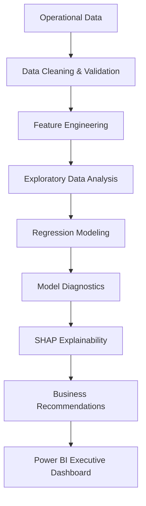

# Differential Pressure Investigation
This repository contains an end-to-end operational analytics project investigating the factors that influence customer differential pressure (DP) within a district cooling network. Using operational telemetry and weather data, the project applies statistical modelling, explainable AI, and business intelligence techniques to identify key operational drivers of DP variability and translate analytical findings into actionable operational recommendations.

## Business Problem
Operations teams observed that customer differential pressure occasionally dropped below the operational target of 12 PSI, particularly during periods of high cooling demand.

### Objective
- Identify the primary operational drivers of customer DP
- Quantify relationships using multiple linear regression
- Evaluate interaction effects and nonlinear relationships
- Develop an executive Power BI dashboard
- Translate statistical findings into operational recommendations

## Project Workflow


## Tech Stack
- Python
- Power BI

## Repository Structure
```
├── data/
│   ├── raw/
│   └── processed/
│
├── notebooks/
│   ├── 01_code.ipynb
│
├── dashboard/
│   └── Operational_Dashboard.pbix
│
├── presentation/
│   └── Executive_Presentation.pdf
│
├── images/
│
├── requirements.txt
└── README.md
```

## Key Findings
The analysis produced several operational insights.
- Output Pressure is the strongest controllable driver of customer DP. Increasing output pressure consistently improved customer differential pressure.
- Weather significantly affects system performance. Higher Humidex increases cooling demand and contributes to reductions in customer DP.
- Peak demand periods increase operational risk. The majority of DP upsets occurred during afternoon peak operating hours.
- Plant interactions influence DP behaviour. After controlling for flow and system demand, Plant 1 demonstrated a sign reversal, highlighting the importance of accounting for confounding variables in operational analytics.
- Interaction effects improve model performance. Including interaction terms better captured the complex relationships between operational variables.

## Business Recommendations
Based on the findings, several operational improvements were recommended:
- Increase output pressure proactively before afternoon demand peaks
- Monitor Humidex-driven cooling demand during summer operations
- Improve plant dispatch strategy during high-demand periods
- Deploy real-time alerts for DP approaching operational thresholds
- Use the executive dashboard to support shift handovers and operational decision-making

## Business Impact
Although this project was completed as an analytical case study, the approach demonstrates how advanced analytics can support operational excellence.
Potential business benefits include:
- Improved customer service reliability
- Reduced pressure upsets
- Faster operational decision-making
- Enhanced visibility into system performance
- Data-driven operational planning

## Lessons Learned
One of the most valuable findings from this project was observing a sign reversal between simple correlation and multiple regression for Plant 1 loading. While the raw correlation suggested a negative relationship with customer DP, the regression model revealed a positive independent effect after controlling for flow, demand, and other operational variables. This reinforced the importance of considering confounding factors and interpreting regression coefficients within the context of the full model rather than relying solely on pairwise correlations.
