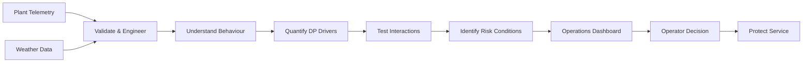
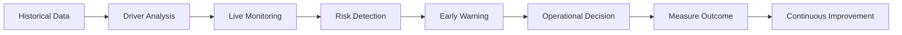

# Operational Analytics: Differential Pressure Investigation in a District Cooling Network

### What drives customer pressure failures — and can operations see them coming?

> **An operational analytics case study transforming plant telemetry and weather data into explainable insights, operational decisions, and an executive Power BI command center.**

<p align="center">
  
</p>

<p align="center">
  <strong>Python</strong> •
  <strong>Statistical Modeling</strong> •
  <strong>Time-Series Analytics</strong> •
  <strong>SHAP</strong> •
  <strong>Power BI</strong> •
  <strong>Operational Decision Support</strong>
</p>

**Project Gallery:** [View all project visualizations](./result_images/)

---

## The Business Problem

In a district cooling network, maintaining adequate **customer differential pressure (DP)** is essential for reliable chilled-water delivery.

Operations observed recurring periods where customer DP dropped below the operational target of **12 PSI**, particularly during periods of elevated cooling demand.

But knowing that DP dropped was not enough.

The more important operational questions were:

> **Why is DP falling?**

> **When is the network most vulnerable?**

> **Which drivers can operations actually influence?**

> **Can deteriorating conditions be recognized before customer service is affected?**

This project was built to answer those questions.

---

## The Decision This Analysis Improves

The objective was not simply to build a statistical model or explain historical plant performance.

The objective was to improve an operational decision:

> ### **When should operators intervene, and which operating conditions should they investigate or adjust, to reduce the risk of customer DP falling below target?**

This reframes the operating approach from:

```text
REACTIVE

DP Falls Below Target
        ↓
Alarm
        ↓
Investigate
        ↓
Respond
```

toward:

```text
PROACTIVE

Risk Conditions Develop
        ↓
Early Warning
        ↓
Identify Key Drivers
        ↓
Evaluate Controllable Levers
        ↓
Operational Intervention
        ↓
Protect Customer Service
```

The goal is to move from simply detecting failure toward **recognizing the conditions that precede it**.

---

## The Analytical Lens

Not every statistically important variable leads to the same type of operational decision.

The investigation therefore looked at the system through four lenses:

| Lens                    | Business Question                                  | Examples                         |
| ----------------------- | -------------------------------------------------- | -------------------------------- |
| **Service Reliability** | Are customers receiving adequate pressure?         | Customer DP, 12 PSI target       |
| **Network Stress**      | When is the system most vulnerable?                | Cooling demand, flow, peak hours |
| **Operational Control** | What can operators potentially influence?          | Output pressure, plant loading   |
| **Early Warning**       | What signals indicate that risk may be increasing? | Humidex, demand, DP trajectory   |

This creates a practical decision hierarchy:

### **Outcome → Risk Signal → Operational Driver → Controllable Lever**

The distinction matters because a variable can be analytically important without being directly controllable.

Weather, for example, cannot be changed — but it may help operations anticipate when system conditions are becoming more demanding.

---

## What Success Would Look Like

A useful analytics solution should ultimately improve operating performance — not simply produce a better model.

If this framework were deployed operationally, success could be measured through:

| Business Outcome             | Operational KPI                                               | Desired Direction |
| ---------------------------- | ------------------------------------------------------------- | ----------------: |
| **Protect customer service** | Frequency of DP events below 12 PSI                           |          Decrease |
| **Reduce event severity**    | Minutes spent below target                                    |          Decrease |
| **Improve response**         | Time from deterioration to intervention                       |          Decrease |
| **Improve anticipation**     | High-risk events identified before threshold breach           |          Increase |
| **Improve peak performance** | Peak-period DP upsets                                         |          Decrease |
| **Increase visibility**      | Shared visibility of DP, demand, weather and plant conditions |          Increase |
| **Improve consistency**      | Use of common operating triggers across shifts                |          Increase |

> **The goal is not simply to explain historical DP. It is to help operations recognize risk earlier and make better-informed decisions before service performance deteriorates.**

---

## From Raw Data to Operational Decision



The analytical workflow deliberately moves through:

### **Data → Evidence → Explanation → Decision → Business Outcome**

---

# What the Data Revealed

## 1. Output Pressure Emerged as the Strongest Controllable Driver

After accounting for other operating conditions, higher system output pressure was consistently associated with improved customer differential pressure.

This distinction is important.

Weather, time of day, and system demand may help explain **when risk increases**, but output pressure represents a potential **operational lever**.

### Why this matters

A purely reactive strategy waits for:

```text
Customer DP < 12 PSI
```

before triggering attention.

The analysis suggests there may be value in evaluating pressure readiness **before** that threshold is crossed, particularly when other risk indicators are already elevated.

### Decision implication

Evaluate output-pressure readiness ahead of known high-demand periods using the wider system context:

### **Current DP + DP Trend + Cooling Demand + Flow + Output Pressure**

Any resulting operational adjustment should remain within approved engineering and equipment limits.

---

## 2. Weather Can Act as an Early-Warning Signal

Higher **Humidex** was associated with changing cooling demand and network conditions.

Weather itself is not controllable.

Its value is therefore not as an operating lever, but as a potential **leading indicator of changing system stress**.

### Decision implication

Weather conditions and expected cooling demand can become part of **pre-peak operational planning**.

For example, elevated Humidex combined with rising cooling demand could trigger closer monitoring of:

* customer DP;
* output pressure;
* network flow;
* plant loading; and
* DP trajectory.

This converts weather from contextual information into a potential **readiness signal**.

---

## 3. Afternoon Peaks Created Elevated DP Risk

DP upsets were concentrated around periods of elevated cooling demand rather than occurring uniformly throughout the day.

<p align="center">
  
</p>

### Why this matters

If risk is concentrated during predictable operating windows, monitoring and intervention do not need to be equally aggressive throughout the entire day.

The operating question changes from:

> *What should we do after DP falls below target?*

to:

> **What conditions tell us that operations should prepare before the high-risk period begins?**

### Decision implication

Historically higher-risk periods can be used to prioritize:

* closer DP monitoring;
* pre-peak operational reviews;
* pressure readiness;
* plant dispatch assessment; and
* earlier escalation when conditions begin to deteriorate.

---

## 4. Correlation Alone Did Not Tell the Whole Story

Exploratory correlation analysis was used to understand the initial relationships between customer DP and the wider operating system.

<p align="center">
  
</p>

One particularly important result involved **Plant 1 loading**.

Its raw correlation with customer DP suggested a negative relationship.

However, after controlling for flow, system demand, and other operational variables, the multivariable regression model revealed a positive independent association.

This sign reversal highlights the role of **confounding variables**.

Plant loading changes alongside other system conditions. Looking at loading and DP alone can therefore produce a different conclusion from examining loading while holding other observed factors constant.

### Decision implication

Plant loading, flow, demand, and pressure should be interpreted as an **interconnected operating system**, rather than as isolated KPIs.

This is why operational recommendations were not derived directly from the correlation matrix.

---

## 5. Multivariable Modeling Helped Separate Overlapping Effects

Multiple linear regression was used to estimate the relationship between each operational variable and customer DP while controlling for other observed system conditions.

<p align="center">
  
</p>

The objective was not simply to identify which variables had the strongest raw relationship with DP.

The more useful question was:

> **After accounting for other observed operating conditions, which variables still contain evidence of an independent relationship with customer DP?**

This distinction provides a stronger analytical foundation for operational interpretation than pairwise correlation alone.

---

## 6. Interaction Effects Better Represented Real Operations

Operational systems rarely behave according to a simple rule such as:

> *Increase X by one unit and Y always changes by the same amount.*

The effect of one operating variable can depend on the state of another.

Interaction terms were therefore introduced to test whether important relationships changed under different operating conditions.

The interaction model improved explanatory performance relative to the simpler specification.

### Decision implication

Operational responses may need to consider **combinations of conditions**, rather than assuming the same relationship applies under every system state.

This reinforces the need to interpret customer DP as the outcome of an interconnected operating environment.

---

## 7. SHAP Provided an Additional Explainability Lens

Statistical modeling answered important questions about independent relationships, but a second interpretability lens was used to examine model behavior.

SHAP values were used to understand:

* which variables were influencing model predictions;
* the direction of their influence; and
* whether model behavior aligned with the broader statistical findings.

<p align="center">
  
</p>

### Why use both statistics and SHAP?

Regression helps answer:

> **What is the estimated independent relationship after controlling for other observed variables?**

SHAP helps answer:

> **What is driving the model's predictions across observations?**

These methods answer different questions.

Using them together provides a stronger explanation than relying on correlation, regression coefficients, or feature importance alone.

---

# From Insight to Action

The analysis suggests a progression from **threshold-based monitoring** toward **risk-aware operations**.

| Observed Condition         | Operational Interpretation           | Potential Response                                     |
| -------------------------- | ------------------------------------ | ------------------------------------------------------ |
| DP trending toward 12 PSI  | Service margin is narrowing          | Increase monitoring and assess current operating state |
| High Humidex expected      | Cooling demand pressure may increase | Prepare for elevated network demand                    |
| Afternoon peak approaching | Historically higher-risk period      | Review DP, flow, loading and output pressure together  |
| High demand + declining DP | Network stress is increasing         | Evaluate controllable operating levers                 |
| Repeated DP excursions     | Persistent service-risk pattern      | Escalate for engineering or operational review         |

This creates a practical sequence:

### **What changed? → What is driving it? → What is controllable? → Is intervention appropriate?**

The recommendations are intended as **decision support**, not automated engineering instructions.

---

# Operations Command Center

Analysis creates business value when decision-makers can use it.

The findings were translated into a **Power BI Operations Command Center** designed around operational questions rather than statistical outputs.

<p align="center">
  
</p>

## The dashboard helps answer five questions

### Are customers currently within target?

Customer DP is monitored against the **12 PSI operating threshold**.

### Is DP deteriorating?

Trend information provides context beyond the current DP reading.

### Is the network entering a higher-risk period?

Cooling demand, Humidex, flow, and peak-period behavior provide context around changing system conditions.

### What conditions are accompanying the deterioration?

Operators can examine output pressure, plant loading, flow, demand, and environmental conditions together.

### Does the situation require closer attention?

DP status and operational KPIs provide a common view for investigation and escalation.

### Dashboard Coverage

* Customer DP vs. 12 PSI target
* DP trend and deterioration
* Network flow
* Cooling demand
* Humidex
* Plant loading
* Peak vs. non-peak performance
* DP status distribution
* Executive operational KPIs

The purpose of the dashboard is not to ask operators or executives to interpret regression coefficients.

It is to translate analytical findings into **operational visibility**.

---

# Recommended Operational Decision Framework

The analysis supports moving from purely reactive threshold monitoring toward a more risk-aware operating framework.

## Before Peak Demand

```text
Weather Conditions
        ↓
Expected Cooling Demand
        ↓
Network Conditions
        ↓
Output Pressure Readiness
        ↓
Operational Preparedness
```

The objective is to identify whether known external conditions suggest that closer monitoring may be required before the historically higher-risk period begins.

---

## During Operations

```text
DP Level
   +
DP Trajectory
   +
Flow & Demand
   +
Plant Conditions
   ↓
Operational Risk
```

Rather than relying on one KPI, the operating state can be evaluated using multiple pieces of evidence.

---

## When Risk Increases

Ask:

### **What changed? → Which drivers are contributing? → Which are controllable? → Is intervention appropriate?**

---

## After a DP Upset

Evaluate:

### **What conditions preceded the event? → How quickly did operations respond? → Could it have been anticipated? → What should change next time?**

This creates a feedback loop between analytics and operational learning.

---

# Business Recommendations

Based on the analytical findings, five operational improvements should be evaluated.

## 1. Pre-Peak Pressure Readiness

Review output-pressure requirements before historically higher-risk demand periods rather than responding only after customer DP deteriorates.

---

## 2. Weather-Informed Planning

Incorporate Humidex and expected cooling demand into shift planning and peak-period readiness.

Weather cannot be controlled, but it can provide context for when operations should increase awareness.

---

## 3. Risk-Based DP Alerts

Move beyond a simple threshold alert:

```text
DP < 12 PSI
      ↓
Alarm
```

toward a framework incorporating:

```text
DP Level
   +
DP Trajectory
   +
Demand
   +
Flow
   +
Weather
   +
Operating Conditions
        ↓
Elevated DP Risk
```

The objective would be to identify deterioration **before** a service threshold is breached.

---

## 4. Integrated Plant Monitoring

Evaluate plant loading alongside system demand, network flow, pressure, and environmental conditions rather than interpreting individual variables independently.

---

## 5. Standardized Shift Visibility

Use a common operational dashboard during shift handovers and operating reviews to improve visibility and decision consistency across teams.

---

# Business Value

This project demonstrates how operational telemetry can be transformed from historical records into a structured **decision-support capability**.

| Business Need                           | Analytical Contribution                                          |
| --------------------------------------- | ---------------------------------------------------------------- |
| **Protect service reliability**         | Identify conditions associated with DP deterioration             |
| **Improve operational readiness**       | Surface predictable peak-demand and weather risk                 |
| **Reduce reactive decision-making**     | Provide earlier visibility into changing conditions              |
| **Improve management visibility**       | Consolidate operational KPIs into a common dashboard             |
| **Strengthen root-cause investigation** | Separate simple correlation from conditional relationships       |
| **Improve decision consistency**        | Provide a shared operational view across shifts                  |
| **Support continuous improvement**      | Create a framework for measuring events, responses, and outcomes |
| **Enable future early warning**         | Establish analytical foundations for real-time DP risk detection |

The project does **not claim realized financial savings or causal operational improvement** from the historical analysis alone.

Its value lies in establishing a framework for improving:

**visibility → anticipation → investigation → response → measurement**

---

# How I Tested the Analytical Story

A single analytical technique was not considered sufficient evidence.

Multiple methods were used to examine the operating system from different perspectives.

## Correlation Analysis

Used as an exploratory tool to identify initial relationships between customer DP and operating variables.

It was not treated as sufficient evidence for operational recommendations.

---

## Multiple Linear Regression

Used to estimate the independent relationship between operational variables and customer DP while controlling for other observed system conditions.

This was particularly important for understanding the sign reversal observed in Plant 1 loading.

---

## Time-Series Diagnostics

Operational telemetry occurs sequentially, meaning observations may not be statistically independent.

Model diagnostics therefore considered time-series behavior.

**Heteroskedasticity and Autocorrelation Consistent (HAC) robust standard errors** were applied to improve statistical inference in the presence of autocorrelation and heteroskedasticity.

---

## Interaction Modeling

Interaction terms were tested to determine whether the relationship between one operational variable and customer DP changed under different system conditions.

---

## SHAP Explainability

SHAP provided a complementary model-interpretability perspective for examining how variables contributed to model predictions across observations.

Together, these methods provided multiple lenses on the same operational problem:

### **Explore → Quantify → Diagnose → Challenge → Explain**

---

# Analytical Boundary

> ## **Statistical association is not automatically physical causation.**

This project identifies statistical relationships, predictive signals, and operational risk indicators within the available historical data.

It does not establish that changing a variable will necessarily produce the corresponding physical response under all operating conditions.

Recommendations involving plant controls should therefore be validated against:

* engineering expertise;
* equipment operating limits;
* network constraints;
* safety requirements;
* control-system logic; and
* controlled operational testing

before being converted into automated control actions.

This distinction is especially important when applying analytics to physical infrastructure.

---

# From Analytics Project to Operational Capability

The current project explains historical operating behavior and identifies conditions associated with customer DP risk.

The natural next step would be converting these insights into a live decision-support capability.



The long-term analytical loop becomes:

## **Observe → Explain → Anticipate → Act → Measure → Improve**

Potential extensions include:

* automated ingestion of live plant telemetry;
* weather forecast integration;
* real-time DP risk scoring;
* early-warning alerts;
* intervention tracking;
* model performance monitoring; and
* measurement of whether operational interventions actually reduce DP excursions.

This would move the analytical capability from:

**What happened?**

to:

**Why did it happen?**

to:

**What conditions indicate that it may happen again?**

to:

**What action should operations consider?**

and finally:

**Did the intervention improve the outcome?**

---

# Tools & Technology

| Capability            | Technology                 |
| --------------------- | -------------------------- |
| Programming           | Python                     |
| Data Analysis         | Pandas, NumPy              |
| Statistical Modeling  | Statsmodels, Scikit-learn  |
| Time-Series Inference | HAC Robust Standard Errors |
| Explainable AI        | SHAP                       |
| Visualization         | Matplotlib, Seaborn        |
| Business Intelligence | Power BI                   |
| Development           | Jupyter Notebook, Git      |

---

# Repository Structure

```text
├── data/
│   ├── raw/
│   └── processed/
│
├── notebooks/
│   └── code.ipynb
│
├── dashboard/
│   └── Ops_Dashboard.pbix
│
├── presentation_slide/
│   └── Operational-Investigation-of-Customer-DP.pptx
│
├── result_images/
│
├── requirements.txt
└── README.md
```

**Project Gallery:** [View all project visualizations](./result_images/)

---

# Challenges & Lessons Learned

## Confounding Can Change the Business Story

The sign reversal observed for Plant 1 loading demonstrated that relationships seen in isolation can be misleading when multiple operational variables move together.

**Lesson:**
Do not turn simple correlations directly into operational recommendations.

---

## Time-Series Data Requires Different Statistical Thinking

Plant telemetry is sequential and can exhibit autocorrelation.

**Lesson:**
Statistical inference should account for the structure of operational data rather than assuming every observation is independent.

---

## Statistical Significance Is Not the Same as Business Significance

A statistically significant variable is not automatically an important operating lever.

Its importance depends on factors such as:

* effect size;
* operational controllability;
* system context;
* service impact; and
* engineering constraints.

**Lesson:**
Model results should be interpreted against the actual business decision, not statistical significance alone.

---

## Explainability Matters

A technically strong model has limited operational value if decision-makers cannot understand its behavior.

**Lesson:**
Model performance and model explainability should be treated as complementary requirements.

---

## Analytics Must End With a Decision

The most important question became less about:

> *What does the model say?*

and more about:

> **What decision should this information improve?**

**Lesson:**
The analytical workflow should connect evidence to a decision and the decision to a measurable outcome.

---

# Skills Demonstrated

### Business & Operational Analytics

`Operational Analytics` `Decision Support` `KPI Design` `Root-Cause Investigation` `Operational Monitoring` `Executive Storytelling`

### Data Science & Statistics

`Regression Analysis` `Time-Series Analysis` `Feature Engineering` `Interaction Effects` `Statistical Diagnostics` `HAC Robust Inference` `Explainable AI`

### Business Intelligence

`Power BI` `Executive Dashboards` `KPI Reporting` `Data Visualization` `Insight-to-Action Translation`

### Technology

`Python` `Pandas` `NumPy` `Statsmodels` `Scikit-learn` `SHAP` `Matplotlib` `Seaborn` `Git` `Jupyter`

---

# The Takeaway

> ## **Reliable operations require more than knowing that a KPI has failed.**
>
> Teams need to understand **when risk is developing, what is driving it, what they can control, and whether their intervention worked.**

This project demonstrates an end-to-end approach to operational analytics:

### **Business Problem → Data → Evidence → Explanation → Decision → Action → Measurement**

The technical work — regression, time-series inference, interaction modeling, SHAP, and Power BI — supports that process.

The end goal is not simply to build a model or dashboard.

## **The goal is to help people make better decisions with data.**

---

# Contact

Interested in discussing **Operational Analytics, Business Intelligence, Data Analytics, Data Science, or data-driven operations**?

Feel free to connect with me.
