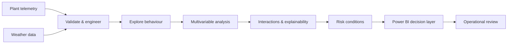
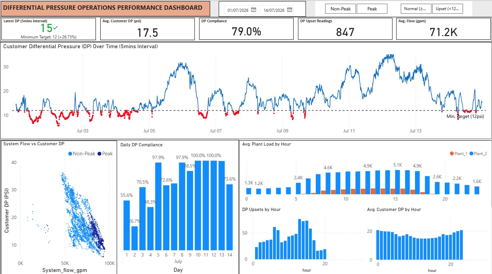

# District Cooling Service-Risk Analytics

### Identifying the operating conditions associated with customer differential-pressure risk

An operational analytics investigation that combines plant telemetry and weather data to explain **when customer differential pressure (DP) becomes vulnerable, which signals provide early warning, and which operating variables warrant closer operational review**.

The work connects statistical analysis to an operations-focused Power BI decision layer while keeping a clear distinction between **association, operational interpretation, and causal engineering conclusions**.


**Project Gallery:** [View project visualizations](./result_images/)

## Results at a glance

| Finding | Evidence | Decision relevance |
|---|---:|---|
| **Peak-period service risk** | 37.9% peak vs. 21.7% non-peak threshold-breach rate | Focus readiness and monitoring on higher-risk operating windows |
| **Pressure-margin compression** | Average DP: 13.57 PSI peak vs. 18.66 PSI non-peak | Monitor deterioration before the 12 PSI threshold is crossed |
| **Weather relationship** | Humidex–DP correlation: `r = -0.74` | Use weather as contextual early-warning information |
| **Network-demand relationship** | Flow–DP correlation: `r = -0.68` | Treat rising network demand as part of the risk context |
| **Multivariable model** | `R² ≈ 0.79` | Separate overlapping relationships among observed operating conditions |
| **Output-pressure relationship** | Approx. `+0.42 PSI` DP per `+10 PSI` output pressure in the fitted model | Potential operational lever requiring engineering validation |

The dataset contains **4,032 time-series observations**. The service threshold used in the analysis is **12 PSI**.

> These results describe relationships in the observed data. They do not, by themselves, establish physical causation or prescribe an operating setpoint.

## The operational problem

Reliable chilled-water delivery depends on maintaining adequate customer differential pressure. Periods below the 12 PSI operating target were not distributed uniformly: risk increased during higher-demand conditions and particular times of day.

The analysis was therefore framed around four practical questions:

> **When is customer DP most vulnerable?**  
> **Which variables remain associated with DP after accounting for other observed conditions?**  
> **Which signals could help operations recognize rising risk earlier?**  
> **Which potential operating levers deserve engineering validation?**

## Decision framework

```text
Observed DP
    ↓
Risk window / trend
    ↓
Demand + weather context
    ↓
Operational-driver analysis
    ↓
Potential controllable levers
    ↓
Engineering validation
    ↓
Operational decision
```

This avoids treating every statistically important variable as directly controllable.

- **Outcome:** customer DP and threshold breaches.
- **Risk context:** time of day, Humidex, cooling demand, and flow.
- **Operational variables:** output pressure and plant loading.
- **Decision layer:** monitoring, readiness, investigation, and validated intervention.

## 1. Peak conditions materially reduced pressure margin

Peak observations had an average customer DP of **13.57 PSI**, compared with **18.66 PSI** during non-peak periods. Relative to the 12 PSI threshold, that reduced the average observed margin from **6.66 PSI to 1.57 PSI**.

The threshold-breach rate was **37.9% during peak conditions (382 of 1,008 observations)** versus **21.7% outside peak conditions**, approximately **1.75× higher**.


### Operational interpretation

Historically higher-risk periods justify closer monitoring and pre-peak review of DP, demand, flow, plant loading, and output-pressure conditions. This is a prioritization signal, not evidence that time of day itself causes a breach.

## 2. Weather and network demand provide useful risk context

Humidex showed a strong negative association with customer DP (`r = -0.74`), while total system flow also showed a strong negative association (`r = -0.68`).


Weather cannot be controlled, but it can contribute to operational readiness. Elevated Humidex combined with rising demand can justify closer attention to the system before pressure margin becomes critical.

## 3. Multivariable analysis separated overlapping effects

Pairwise correlations are useful for exploration but can be misleading when operating variables move together. Multiple linear regression was therefore used to estimate each variable's adjusted relationship with customer DP while controlling for the other observed variables in the model.


The fitted model explained approximately **79% of observed DP variation (`R² ≈ 0.79`)**. HAC robust standard errors were used to reduce sensitivity to heteroskedasticity and serial correlation in the time-series residuals.

### Output pressure

Output pressure showed the strongest positive adjusted association among the evaluated operational variables. In the fitted specification, a 10 PSI increase in output pressure corresponded to approximately **+0.42 PSI customer DP**, holding the other included variables constant.

That makes output pressure a **candidate operational lever for engineering evaluation**, not proof that increasing pressure by a particular amount will produce the same causal response in live operations.

## 4. Plant loading illustrates why correlation is not causation

Exploratory analysis showed that plant loading, network flow, demand, and customer DP moved together in ways that changed after statistical controls were introduced.


Plant 1 in particular showed a sign reversal between simple and controlled relationships. This is consistent with **confounding or dispatch effects**: plant loading may change in response to the same demand conditions that are affecting DP.

### Plausible operating interpretation — not a proven mechanism

One possible explanation is that different plants play different roles across base-load and higher-demand conditions, and that an additional plant may be dispatched as system stress increases. Under that interpretation, plant loading can appear negatively associated with DP in raw data even if its adjusted relationship changes after demand and flow are controlled.

The available observational data does **not** establish plant dispatch strategy or hydraulic causality. Confirming that explanation would require operating logs, plant sequencing information, network topology, and engineering review.

This distinction is intentional: the statistical model identifies relationships worth investigating; it does not replace domain validation.

## 5. Interaction effects represent changing system states

The effect of one operating variable may depend on the level of another. Interaction terms were therefore evaluated to test whether important relationships changed under different system states rather than assuming a constant effect everywhere.

The interaction specification improved explanatory performance relative to the simpler model, supporting the broader conclusion that customer DP should be interpreted as the outcome of an interconnected operating environment.

## 6. SHAP adds a model-behaviour lens

SHAP was used as a second interpretability lens to examine which features influenced model predictions and whether their direction broadly aligned with the statistical analysis.

SHAP is used here to explain the fitted model's behaviour; it is **not presented as causal evidence**.

## From analysis to decision support


```mermaid
flowchart LR
    A[Plant telemetry] --> C[Validate & engineer]
    B[Weather data] --> C
    C --> D[Explore behaviour]
    D --> E[Multivariable analysis]
    E --> F[Interactions & explainability]
    F --> G[Risk conditions]
    G --> H[Power BI decision layer]
    H --> I[Operational review]
```

The dashboard translates the analysis into a common operating view of DP performance, demand, weather, flow, and plant conditions.



## What success would look like in operational use

If the framework were implemented in a live operating environment, useful outcome measures would include:

| Business outcome | KPI | Desired direction |
|---|---|---:|
| Protect customer service | Frequency of DP observations/events below target | Decrease |
| Reduce severity | Duration below target | Decrease |
| Improve response | Time from deterioration to intervention | Decrease |
| Improve anticipation | High-risk conditions identified before breach | Increase |
| Improve peak performance | Peak-period DP upsets | Decrease |
| Improve visibility | Shared view of DP, demand, weather, and plant conditions | Increase |

These are **deployment success criteria**, not outcomes claimed by the historical analysis.

## Analytical approach

1. Validate and align five-minute plant telemetry with hourly weather data.
2. Define the 12 PSI service threshold and peak/non-peak operating windows.
3. Explore distributions, time patterns, and pairwise relationships.
4. Fit multivariable regression to separate overlapping associations.
5. Use HAC robust inference for time-series dependence concerns.
6. Test interaction terms for changing operating states.
7. Use SHAP as an additional model-explainability check.
8. Translate the evidence into an operations-focused dashboard and decision framework.

## Limitations and responsible interpretation

- The analysis is observational; statistical association does not establish physical causation.
- `R²` describes in-sample explanatory fit and should not be interpreted as guaranteed operational predictive performance.
- Regression coefficients depend on the model specification and observed operating range.
- Plant-loading relationships may reflect dispatch logic, demand, network topology, or omitted operating conditions.
- The 12 PSI threshold is used as the service-risk definition for this analysis; operational actions should remain within approved engineering and equipment limits.
- A production early-warning system would require prospective validation, monitoring, and explicit alert-performance metrics.

## Repository guide

### Folder structure

```text
.
├── README.md
├── data/
│   ├── telemetry_data.xlsx
│   └── merged_operational_data.csv
├── notebooks/
│   └── code_analysis.ipynb
├── dashboard/
│   └── OpsView_Dashboard.pbix
└── result_images/
    └── Analysis charts and dashboard screenshots
```

### Where to find each resource

| Resource | File or folder | Purpose |
|---|---|---|
| Project overview | [README.md](./README.md) | Business problem, findings, operational interpretation, and limitations |
| Telemetry workbook | [telemetry_data.xlsx](./data/telemetry_data.xlsx) | Operational data in Excel format |
| Merged dataset | [merged_operational_data.csv](./data/merged_operational_data.csv) | Combined data for analysis |
| Analysis notebook | [code_analysis.ipynb](./notebooks/code_analysis.ipynb) | Exploratory analysis, statistical modeling, and model interpretation |
| Power BI dashboard | [OpsView_Dashboard.pbix](./dashboard/OpsView_Dashboard.pbix) | Interactive reporting file for Power BI Desktop |
| Visual evidence | [result_images/](./result_images/) | Analysis charts and dashboard screenshots referenced in this guide |

Presentation materials in `presentation slide/` and `slide results/` are kept locally and excluded from Git tracking.

### Suggested reading order

1. **Understand the findings:** start with [Results at a glance](#results-at-a-glance) and the operational interpretation in this README.
2. **Review the evidence:** browse the [charts and dashboard screenshots](./result_images/).
3. **Explore the analysis:** open the [notebook](./notebooks/code_analysis.ipynb) and inspect the supporting [datasets](./data/).
4. **Explore the reporting:** open the [dashboard](./dashboard/OpsView_Dashboard.pbix) in Power BI Desktop.

---

**Core stack:** Python · pandas · statsmodels · scikit-learn · SHAP · Power BI
