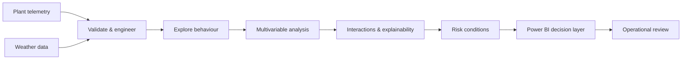

# District Cooling Service-Risk Analytics

### Identifying the operating conditions associated with customer differential-pressure risk

An operational analytics investigation that combines plant telemetry and weather data to explain **when customer differential pressure (DP) becomes vulnerable, which signals provide context for monitoring, and which operating variables warrant closer operational review**.

The work connects statistical analysis to an operations-focused Power BI decision layer while keeping a clear distinction between **association, operational interpretation, and causal engineering conclusions**.

**Chart basis:** both groups use five-minute readings below 12 PSI. Peak is the highest quartile of cooling demand.


**Project Gallery:** [View project visualizations](./result_images/)

## Results at a glance

| Finding | Evidence | Decision relevance |
|---|---:|---|
| **Peak-period service risk** | 37.9% peak vs. 15.4% non-peak five-minute threshold-breach rate | Focus readiness and monitoring on higher-risk operating windows |
| **Pressure-margin compression** | Average DP: 13.57 PSI peak vs. 18.82 PSI non-peak | Monitor deterioration before the 12 PSI threshold is crossed |
| **Weather relationship** | Humidex–DP correlation: `r = -0.74` | Use weather as contextual early-warning information |
| **Network-demand relationship** | Flow–DP correlation: `r = -0.68` | Treat rising network demand as part of the risk context |
| **Multivariable model** | `R² ≈ 0.79` | Separate overlapping relationships among observed operating conditions |
| **Output-pressure relationship** | Approx. `+1.12 PSI` DP per one sample SD of output pressure in the base model | Conditional association; operating changes require engineering validation |

The dataset contains **4,032 five-minute observations from July 1–14, 2026**. The service threshold is **12 PSI**. **Peak** means cooling demand at or above the sample's 75th percentile (**67,351.04 tons**); it is not a fixed time-of-day window. Both headline breach rates use five-minute readings.

**Project scope:** this repository documents data preparation, exploratory analysis, regression with HAC uncertainty estimates, model explanation, and a Power BI reporting view. It is an explanatory case study; no deployed alerting system or measured business improvement is claimed.

**Data provenance:** the supplied workbook and CSV contain anonymized operational data, as confirmed by the repository owner. Source attribution and reuse terms are not documented in this repository. The workbook is the input for rebuilding the analysis, and the CSV is used to reconcile the resulting measurements.

> These results describe relationships in the observed data. They do not, by themselves, establish physical causation or prescribe an operating setpoint.

## The operational problem

Reliable chilled-water delivery depends on maintaining adequate customer differential pressure. Periods below the 12 PSI operating target were not distributed uniformly: risk increased during higher-demand conditions and particular times of day.

The analysis was therefore framed around four practical questions:

> **When is customer DP most vulnerable?**  
> **Which variables remain associated with DP after accounting for other observed conditions?**  
> **Which signals could help operations recognize rising risk earlier?**  
> **Which potential operating levers deserve engineering validation?**

## Decision framework

```text
Observed DP
    ↓
Risk window / trend
    ↓
Demand + weather context
    ↓
Operational-driver analysis
    ↓
Potential controllable levers
    ↓
Engineering validation
    ↓
Operational decision
```

This avoids treating every statistically important variable as directly controllable.

- **Outcome:** customer DP and threshold breaches.
- **Risk context:** time of day, Humidex, cooling demand, and flow.
- **Operational variables:** output pressure and plant loading.
- **Decision layer:** monitoring, readiness, investigation, and validated intervention.

## 1. Peak conditions materially reduced pressure margin

Peak observations had an average customer DP of **13.57 PSI**, compared with **18.82 PSI** during non-peak periods. Relative to the 12 PSI threshold, that reduced the average observed margin from **6.82 PSI to 1.57 PSI**.

The threshold-breach rate was **37.9% during peak conditions (382 of 1,008 readings)** versus **15.4% outside peak conditions (465 of 3,024 readings)**, approximately **2.46× higher**. The overall breach rate is **21.0% (847 of 4,032 readings)**. These counts describe five-minute readings, not separate incidents.


The separate non-peak hourly measure retained in the notebook is **21.7% (57 of 263 hours)**, where an hour is flagged if any included non-peak reading is below 12 PSI. Its average of hourly DP means is approximately **18.66 PSI**. These hourly measures have different weighting and must not replace the five-minute comparison above.

### Operational interpretation

Historically higher-risk periods justify closer monitoring and pre-peak review of DP, demand, flow, plant loading, and output-pressure conditions. This is a prioritization signal, not evidence that time of day itself causes a breach.

## 2. Weather and network demand provide useful risk context

Humidex showed a strong negative association with customer DP (`r = -0.74`), while total system flow also showed a strong negative association (`r = -0.68`).


Weather cannot be controlled, but it can contribute to operational readiness. Elevated Humidex combined with rising demand can justify closer attention to the system before pressure margin becomes critical.

## 3. Multivariable analysis separated overlapping effects

Pairwise correlations are useful for exploration but can be misleading when operating variables move together. Multiple linear regression was therefore used to estimate each variable's adjusted relationship with customer DP while controlling for the other observed variables in the model.


**Coefficient units:** the preserved chart standardizes the predictors only; customer DP remains in PSI. Its values are **PSI per one sample standard deviation of each predictor**, not fully standardized, unitless coefficients. The title's “moves” should be read as a conditional association, not a causal effect. Plant 1 has the largest positive coefficient among the displayed predictors; output pressure is not ranked first.

The fitted model explained approximately **79% of observed DP variation (`R² ≈ 0.79`)**. HAC robust standard errors were used to reduce sensitivity to heteroskedasticity and serial correlation in the time-series residuals.

### Output pressure

Output pressure had a positive conditional association with customer DP in the base model: approximately **+1.12 PSI DP per one sample standard deviation of output pressure (2.33 PSI)**. In original units, this is approximately **+0.480 PSI DP per +1 PSI output pressure**, holding the included variables constant. The equivalent +10 PSI model-unit translation is approximately +4.80 PSI DP; it is not an operating recommendation or an experimentally measured response.

The base model's 95% HAC interval is approximately **+0.350 to +0.610 PSI DP per +1 PSI output pressure**, using 12 lags. Excluding the five negative Plant 2 readings gives approximately +0.480 PSI per +1 PSI, close to the original estimate. The notebook also checks HAC lag sensitivity. Correlated operating conditions, dispatch responses, and model specification may affect interpretation; no pressure change is prescribed.

## 4. Plant loading illustrates why correlation is not causation

Exploratory analysis showed that plant loading, network flow, demand, and customer DP moved together in ways that changed after statistical controls were introduced.


Plant 1 in particular showed a sign reversal between simple and controlled relationships. This is consistent with **confounding or dispatch effects**: plant loading may change in response to the same demand conditions that are affecting DP.

### Plausible operating interpretation — not a proven mechanism

One possible explanation is that different plants play different roles across base-load and higher-demand conditions, and that an additional plant may be dispatched as system stress increases. Under that interpretation, plant loading can appear negatively associated with DP in raw data even if its adjusted relationship changes after demand and flow are controlled.

The available observational data does **not** establish plant dispatch strategy or hydraulic causality. Confirming that explanation would require operating logs, plant sequencing information, network topology, and engineering review.

This distinction is intentional: the statistical model identifies relationships worth investigating; it does not replace domain validation.

## 5. Interaction effects represent changing system states

The effect of one operating variable may depend on the level of another. Interaction terms were therefore evaluated to test whether important relationships changed under different system states rather than assuming a constant effect everywhere.

On the same observations, base-model R-squared is **0.7856**, rising to **0.8646** with the interaction and squared-Humidex terms. This is **in-sample explanatory fit**, not demonstrated forecasting performance. The interaction specification describes how the fitted association varies with the included conditions.

## 6. SHAP adds a model-behaviour lens

SHAP explains a Random Forest fitted to the base predictor set. The mean absolute SHAP summary describes the magnitude of feature contributions to that model on training observations; it does not show the direction of an effect or independently validate the regression.

SHAP is used here to explain the fitted model's behaviour; it is **not presented as causal evidence**. The Random Forest score is explicitly a training score. Predictive or early-warning performance would require a defined forecast horizon, chronological evaluation, and a baseline.

## From analysis to decision support


```mermaid
flowchart LR
    A[Plant telemetry] --> C[Validate & engineer]
    B[Weather data] --> C
    C --> D[Explore behaviour]
    D --> E[Multivariable analysis]
    E --> F[Interactions & explainability]
    F --> G[Risk conditions]
    G --> H[Power BI decision layer]
    H --> I[Operational review]
```

The dashboard translates the analysis into a common operating view of DP performance, demand, weather, flow, and plant conditions.


**Dashboard walkthrough:** start with the 12 PSI threshold and overall compliance, inspect when readings fall below target, then compare those periods with flow and plant loading. The displayed **847 upset readings** are five-minute samples, not 847 distinct incidents. “Latest DP” refers to the end of this historical dataset, not live telemetry.

The saved Power BI file and screenshot are preserved; interactive refresh, model relationships, and DAX measures have not been revalidated in this revision. Use the notebook's explicitly defined cooling-demand peak classification and corrected table when interpreting peak/non-peak results.

## What success would look like in operational use

If the framework were implemented in a live operating environment, useful outcome measures would include:

| Business outcome | KPI | Desired direction |
|---|---|---:|
| Protect customer service | Frequency of DP observations/events below target | Decrease |
| Reduce severity | Duration below target | Decrease |
| Improve response | Time from deterioration to intervention | Decrease |
| Improve anticipation | High-risk conditions identified before breach | Increase |
| Improve peak performance | Peak-period DP upsets | Decrease |
| Improve visibility | Shared view of DP, demand, weather, and plant conditions | Increase |

These are **deployment success criteria**, not outcomes claimed by the historical analysis.

## Analytical approach

1. Validate and align five-minute plant telemetry with hourly weather data.
2. Define the 12 PSI threshold and peak/non-peak groups using the 75th percentile of cooling demand.
3. Explore distributions, time patterns, and pairwise relationships.
4. Fit multivariable regression to separate overlapping associations.
5. Use HAC robust inference for time-series dependence concerns.
6. Test interaction terms for changing operating states.
7. Use SHAP as an additional model-explainability check.
8. Translate the evidence into an operations-focused dashboard and decision framework.

## Limitations and responsible interpretation

- The analysis is observational; statistical association does not establish physical causation.
- `R²` describes in-sample explanatory fit and should not be interpreted as guaranteed operational predictive performance.
- Regression coefficients depend on the model specification and observed operating range.
- Plant-loading relationships may reflect dispatch logic, demand, network topology, or omitted operating conditions.
- The 12 PSI threshold is used as the service-risk definition for this analysis; operational actions should remain within approved engineering and equipment limits.
- A production early-warning system would require prospective validation, monitoring, and explicit alert-performance metrics.
- HAC covariance adjusts coefficient uncertainty; it does not remove residual autocorrelation or make an observational model causal. The notebook compares 6, 12, 24, and 48 lags.
- Plant 2 readings at or below 1 use the existing zero-production cleaning convention. The notebook retains original readings and checks sensitivity to excluding the negative readings.
- The supplied CSV retains a legacy `is_peak` field based on high Humidex. The corrected notebook defines `is_peak` from cooling demand to agree with `peak_condition`; it does not overwrite the CSV.
- The peak/non-peak breach chart uses the corrected five-minute comparison. Other historical images are retained, with aggregation and coefficient-unit context explained alongside them. The recomputed notebook tables are the reference for current numerical claims.

## Repository guide

### Folder structure

```text
.
├── README.md
├── data/
│   ├── telemetry_data.xlsx
│   └── merged_operational_data.csv
├── notebooks/
│   └── code_analysis.ipynb
├── dashboard/
│   └── OpsView_Dashboard.pbix
└── result_images/
    └── Analysis charts and dashboard screenshots
```

### Where to find each resource

| Resource | File or folder | Purpose |
|---|---|---|
| Project overview | [README.md](./README.md) | Business problem, findings, operational interpretation, and limitations |
| Telemetry workbook | [telemetry_data.xlsx](./data/telemetry_data.xlsx) | Operational data in Excel format |
| Merged dataset | [merged_operational_data.csv](./data/merged_operational_data.csv) | Combined data for analysis |
| Analysis notebook | [code_analysis.ipynb](./notebooks/code_analysis.ipynb) | Exploratory analysis, statistical modeling, and model interpretation |
| Power BI dashboard | [OpsView_Dashboard.pbix](./dashboard/OpsView_Dashboard.pbix) | Interactive reporting file for Power BI Desktop |
| Visual evidence | [result_images/](./result_images/) | Analysis charts and dashboard screenshots referenced in this guide |

Presentation materials in `presentation slide/` and `slide results/` are kept locally and excluded from Git tracking.

### Reproduce the analysis

The notebook was checked with **Python 3.9.13** and the package versions below. To keep the existing repository structure, dependencies are listed here rather than in an additional manifest. From the repository root, create an environment outside the repository and install the analysis packages (PowerShell):

```powershell
python -m venv "$env:TEMP\wavy-analysis-env"
& "$env:TEMP\wavy-analysis-env\Scripts\python.exe" -m pip install numpy==2.0.2 pandas==2.3.3 scipy==1.13.1 openpyxl==3.1.5 matplotlib==3.9.4 seaborn==0.13.2 statsmodels==0.14.4 patsy==1.0.1 scikit-learn==1.6.1 shap==0.49.1 ipykernel==6.31.0 nbclient==0.10.2
```

Open `notebooks/code_analysis.ipynb` in VS Code, select that environment's Python interpreter as the notebook kernel, and choose **Restart Kernel → Run All**. Run from the repository root or `notebooks/`; the notebook resolves the data directory from either location. It displays plots inline and does not overwrite the supplied CSV, workbook, dashboard, or published images.

The run checks timestamp uniqueness, five-minute spacing, weather coverage, agreement of nine rebuilt measurement columns with the supplied CSV, and the headline breach counts. It also computes coefficient units, HAC lag sensitivity, and sensitivity to excluding negative Plant 2 readings. No separate Power BI refresh is required to reproduce these Python results.

### Suggested reading order

1. **Understand the findings:** start with [Results at a glance](#results-at-a-glance) and the operational interpretation in this README.
2. **Review the evidence:** browse the [charts and dashboard screenshots](./result_images/).
3. **Explore the analysis:** open the [notebook](./notebooks/code_analysis.ipynb) and inspect the supporting [datasets](./data/).
4. **Explore the reporting:** open the [dashboard](./dashboard/OpsView_Dashboard.pbix) in Power BI Desktop.

---

**Core stack:** Python · pandas · statsmodels · scikit-learn · SHAP · Power BI
